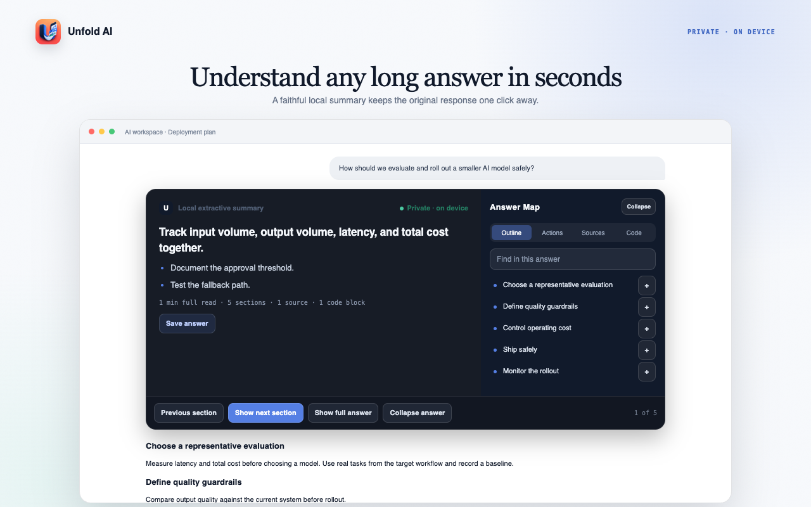
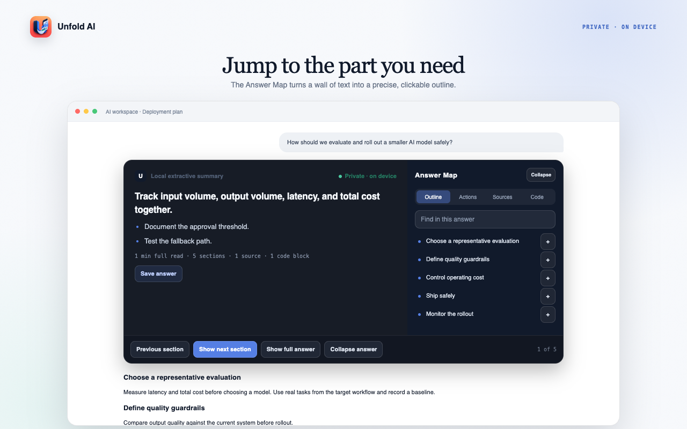
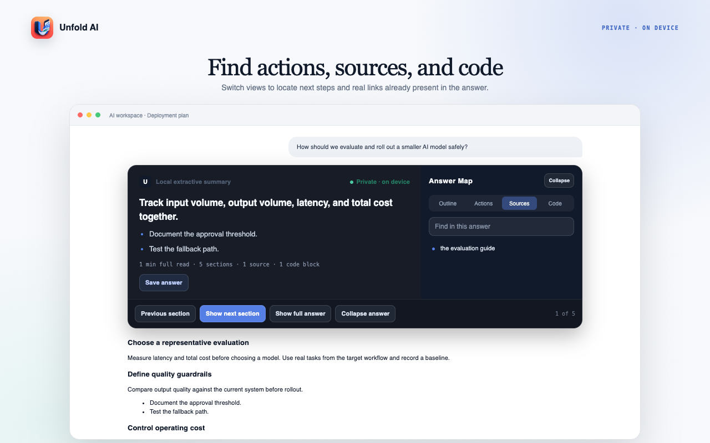
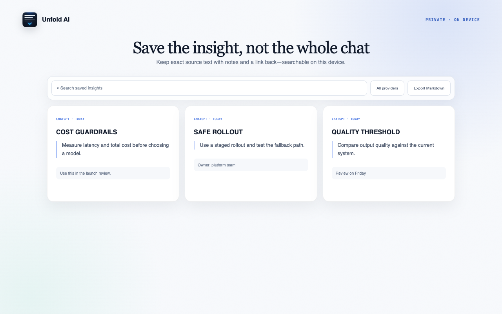
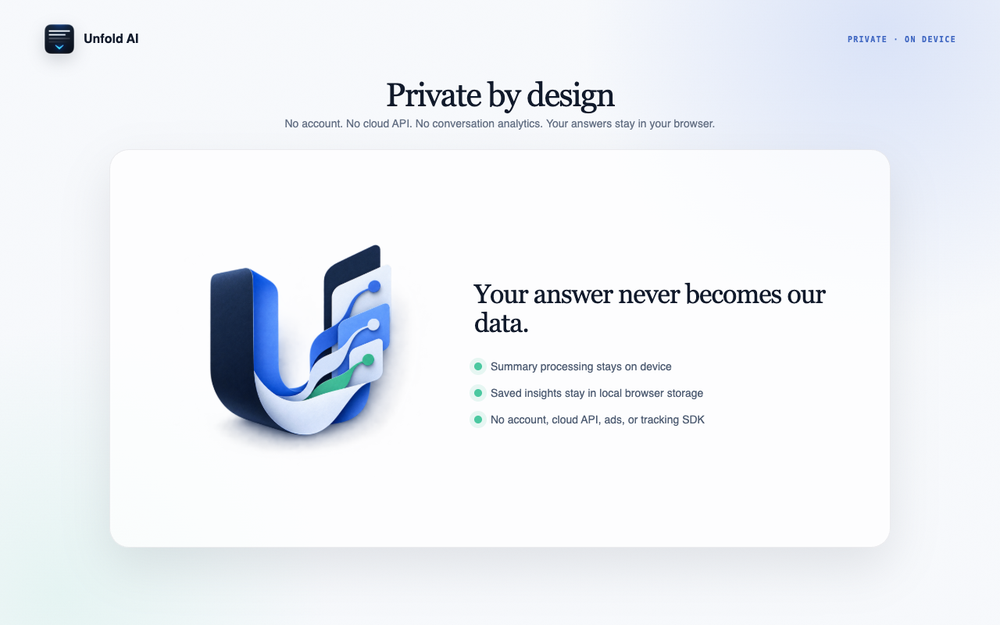

<div align="center">


# Unfold AI

### Long AI answers, made navigable.

**A private reading layer for AI chats.** See the bottom line, jump to any section, reveal the answer at your pace, and save only the insight you need—without sending the conversation anywhere.

[](https://chromewebstore.google.com/detail/unfold-ai-ai-output-contr/bmaehlmglmcpgokdlbniifhgnfgajfkl)
[](https://addons.mozilla.org/firefox/addon/unfold-ai-ai-output-controller/)


**[Add to Chrome](https://chromewebstore.google.com/detail/unfold-ai-ai-output-contr/bmaehlmglmcpgokdlbniifhgnfgajfkl) · [Add to Firefox](https://addons.mozilla.org/firefox/addon/unfold-ai-ai-output-controller/) · [See how it works](#your-answer-unfolded) · [Privacy](#privacy-by-architecture) · [Report an issue](https://github.com/onekapisch/Unfold-AI/issues)**


</div>

> **The original answer stays the source of truth.** Unfold adds a local summary, Answer Map, and reading controls around it. The complete response is always one click away.

## AI chats are chronological. Answers are not.

A useful answer may contain a conclusion, five sections, three actions, two sources, and a code block. Most AI interfaces give all of that one shape: a long vertical scroll.

Browser Find can locate a word. Asking the AI to summarize creates another answer. Unfold works on the response already in front of you—after generation finishes—and turns it into something you can scan, navigate, and revisit.

No second prompt. No parallel cloud workspace. No replacement for the original.

## Your answer, unfolded

### 01 · Understand it in seconds

See one bottom-line sentence and source-derived key points before committing to the full read. Unfold labels the summary engine it used, shows the answer's structure at a glance, and leaves the original response intact.



<table>
<tr>
<td width="50%" valign="top">
<strong>02 · Jump to the part you need</strong><br><br>
The Outline turns one long response into direct section links. Move through the answer without hunting through the page.
<br><br>

</td>
<td width="50%" valign="top">
<strong>03 · Find actions, sources, and code</strong><br><br>
Switch Answer Map views to isolate list actions, real links, and code blocks already present in the response.
<br><br>

</td>
</tr>
</table>

### 04 · Read at your pace

Start with one section in **Focus**, two in **Balanced**, or the complete response in **Full context**. Reveal the next section, expand everything, or restore the original answer without losing your place.

### 05 · Save the insight, not the whole chat

Keep exact answer text with a note and link back. Search it locally, copy it, export Markdown, or back up the library as JSON.



## How it works

1. **Waits for the answer to finish.** Unfold avoids fighting the streaming UI and leaves short answers alone.
2. **Builds a local document model.** Headings, paragraphs, lists, links, and code blocks become structured sections.
3. **Summarizes locally.** Chrome can use its built-in on-device model when available; every supported browser has a deterministic extractive fallback.
4. **Adds the Answer Map.** Outline, Actions, Sources, Code, and search all point back to the rendered response.
5. **Saves only when asked.** Exact answer text enters the private library only after you choose **Save answer**.

## What you get

- **A real summary, not just collapsed text.** One bottom line plus source-derived key points.
- **Response-level navigation.** Jump inside one answer rather than merely between messages.
- **Purpose-built views.** Pull out actions, links, and code without altering the response.
- **Progressive reading.** Focus, Balanced, and Full context modes match how much detail you want now.
- **Private Saved Insights.** Search, annotate, copy, delete, export to Markdown, and back up locally.
- **A safe default.** Short answers stay untouched, unsupported pages stay untouched, and the full original is recoverable.
- **No setup tax.** No account, API key, cloud service, or subscription.

## Supported AI sites

| Site | Included adapter |
|---|:---:|
| [ChatGPT](https://chatgpt.com) | ✓ |
| [Claude](https://claude.ai) | ✓ |
| [Gemini](https://gemini.google.com) | ✓ |
| [Grok](https://grok.com) | ✓ |
| [Perplexity](https://www.perplexity.ai) | ✓ |
| [DeepSeek](https://chat.deepseek.com) | ✓ |
| [Manus](https://manus.im) | ✓ |

AI sites change their private page structure over time. If one stops unfolding correctly, [open a compatibility report](https://github.com/onekapisch/Unfold-AI/issues) with the provider, browser version, and a synthetic example—never a private conversation.

## Privacy by architecture



| Data | What Unfold does |
|---|---|
| Rendered AI answers | Reads them locally in the active supported page to build the summary and map |
| Settings and reveal state | Keeps them in browser-local extension storage |
| Saved answer text | Writes it to extension-owned IndexedDB only after **Save answer** |
| Analytics and telemetry | None |
| Account or user identifier | None |
| Remote AI or application server | None |

Unfold has no analytics SDK, tracking pixel, advertising, remote code, or cloud sync. Read the complete [Privacy Policy](PRIVACY.md) and [Security & Privacy notes](SECURITY.md).

## Install

### Chrome

1. **[Open Unfold AI in the Chrome Web Store](https://chromewebstore.google.com/detail/unfold-ai-ai-output-contr/bmaehlmglmcpgokdlbniifhgnfgajfkl)**.
2. Select **Add to Chrome** and approve access to the supported AI sites.
3. Open a long answer on a supported site. Unfold appears after the response finishes.

Requires Chrome 109 or later.

### Firefox

1. **[Open Unfold AI on Firefox Add-ons](https://addons.mozilla.org/firefox/addon/unfold-ai-ai-output-controller/)**.
2. Select **Add to Firefox** and approve access to the supported AI sites.
3. Open a long answer on a supported site. Use the toolbar button for reading preferences and Saved Insights.

Requires Firefox 140 or later on desktop, or Firefox for Android 142 or later.

## Measured, not marketed

The 2.0 release gate records the scope behind the claims:

| Check | Verified result |
|---|---:|
| Automated tests | 53 passed |
| TypeScript errors | 0 |
| Lint errors and warnings | 0 |
| Firefox `web-ext` errors, warnings, and notices | 0 |
| Runtime npm dependencies | 0 |
| Remote code | 0 |
| Production files in each store archive | 25 allowlisted files |

See the dated [2.0 release evidence](docs/verification/2.0-release-evidence.md) for the exact commands, package boundaries, and remaining human compatibility checks.

## Build from source

Requirements: Node.js 20+ and npm.

```bash
git clone https://github.com/onekapisch/Unfold-AI.git
cd Unfold-AI
npm ci
npm test
```

Build Chrome Manifest V3:

```bash
npm run build
```

Load `dist/` from `chrome://extensions` with **Developer mode → Load unpacked**.

Build Firefox Manifest V2:

```bash
npm run build:firefox
```

Load `dist-firefox/manifest.json` from `about:debugging`.

Run the complete local release gate:

```bash
npm run verify
```

No environment variables, API keys, database, or server are required.

## Architecture

| Area | Responsibility |
|---|---|
| `src/providers/` | Provider-specific answer discovery and streaming detection |
| `src/core/` | Document model, summary engines, navigation, settings, and persistence |
| `src/content/` | Lifecycle and isolated Shadow DOM reading interface |
| `src/background/` | Extension-owned persistence and validated runtime messages |
| `src/popup/` | Reading modes, activation, provider, and summary preferences |
| `src/saved/` | Searchable local Saved Insights library |
| `preview/` | Deterministic store artwork source, excluded from release packages |

Chrome and Firefox share the core product model while keeping browser-specific manifests and builds. Source content is inserted as text, runtime messages and JSON imports are validated, and release archives are assembled from explicit allowlists.

## FAQ

<details>
<summary><strong>Does Unfold send private chats anywhere?</strong></summary>
<br>
No. It processes the rendered answer inside your browser. There is no Unfold server, account system, analytics endpoint, or conversation telemetry.
</details>

<details>
<summary><strong>Does it rewrite or hide the original answer?</strong></summary>
<br>
No. The original response remains the source of truth. Unfold adds structure around it, and **Show full answer** restores the complete response in one click.
</details>

<details>
<summary><strong>How is the summary generated?</strong></summary>
<br>
Chrome can use its built-in on-device summarization model when the browser makes it available and you enable it. Otherwise Unfold uses a deterministic local extractive summary derived from the answer already on the page. Firefox uses the extractive path. Neither path calls a remote Unfold service.
</details>

<details>
<summary><strong>Why does it need access to AI websites?</strong></summary>
<br>
The extension must read completed assistant answers and place the summary, map, and reading controls beside them. Host access is limited to the seven named AI origins in the manifest.
</details>

<details>
<summary><strong>What happens to Saved Insights?</strong></summary>
<br>
They stay in extension-owned IndexedDB on that browser profile until you delete them or remove the extension. Export Markdown for reading, or JSON for a restorable local backup. Unfold has no remote backup and cannot recover deleted records.
</details>

<details>
<summary><strong>Is Unfold a prompt manager or cloud knowledge base?</strong></summary>
<br>
No. It is deliberately narrower: a reading and navigation layer for the answer already in front of you. It does not automate prompts, sync conversations, or create a shared workspace.
</details>

## Feedback and compatibility reports

Provider compatibility reports, accessibility reports, and focused feature proposals are welcome. Start with an [issue](https://github.com/onekapisch/Unfold-AI/issues) so the behavior and privacy boundary are clear. A source license will be published before external code contributions are accepted.

When reporting a provider issue, include:

- provider and exact browser version;
- what Unfold displayed versus what you expected;
- a synthetic reproduction or redacted screenshot;
- console output only after checking it for private text.

## More from Kapisch

- **[Mac 4 Breakfast](https://github.com/onekapisch/Mac-4-Breakfast)** — battery health, live power, devices, and Smart Alerts in one native Mac app.
- **[Tokens 4 Breakfast](https://github.com/onekapisch/Tokens4Breakfast-daily)** — AI token usage, subscriptions, spend, and rate-limit pressure from the menu bar.
- **[Clip 4 Breakfast](https://github.com/onekapisch/clip-4-breakfast-public)** — a private, keyboard-first clipboard manager built around Recall, Keep, Transform, and Deliver.

---

<div align="center">

### Spend less time searching the answer. Use it.

**[Add to Chrome](https://chromewebstore.google.com/detail/unfold-ai-ai-output-contr/bmaehlmglmcpgokdlbniifhgnfgajfkl) · [Add to Firefox](https://addons.mozilla.org/firefox/addon/unfold-ai-ai-output-controller/) · [Star Unfold AI](https://github.com/onekapisch/Unfold-AI)**

<sub>Unfold AI is a private ChatGPT summarizer, Claude answer navigator, and local AI-reading extension for Chrome and Firefox. Built by <a href="https://github.com/onekapisch">Kapisch</a> in Germany.</sub>

</div>
